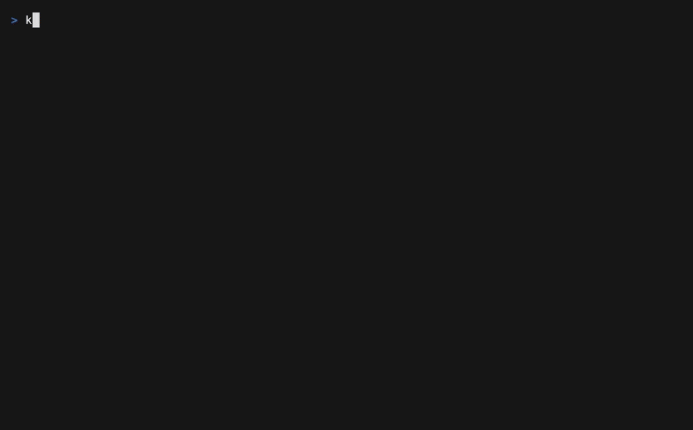

# Action parameters

This runnable project replaces families of nearly identical commands with one
typed action definition. It demonstrates `select`, `radio`, `checkbox`,
`number`, and optional `text` controls; argv, flag, argument, and environment
projections; value-dependent confirmation; option-selected commands; and
static prerequisite values.

<div class="demo-frame">



</div>

## Try the TUI

From the repository root:

```bash
make build
./bin/kranz -C examples/action-parameters
```

Open `infra`, focus `seed`, and press `Enter`. The command preview and every
parameter appear below the action in declaration order. `Enter` opens a choice
or starts editing text, `Space` marks a choice or toggles a checkbox, arrow keys
step through compact choices and numbers, and `d` temporarily leaves one value
out. Press `c` for the full parameter form or `s` to run the current values.

Turning on `write` adds a confirmation reason. The modal shows the normalized
values and the exact command before the runtime reserves the execution slot.

## Try the CLI

Start an empty background runtime, inspect the accepted schema, and run one
invocation:

```bash
./bin/kranz -C examples/action-parameters up -d
./bin/kranz -C examples/action-parameters actions info infra/seed
./bin/kranz -C examples/action-parameters actions run infra/seed \
  --param env=staging \
  --param count=250 \
  --param label='release check'
./bin/kranz -C examples/action-parameters down
```

Use `--no-param label` to leave the optional value out explicitly. This differs
from omitting a flag for a parameter that has a default: omission selects that
default. Repeating a checkbox-group parameter adds values; repeating a
single-value parameter is rejected.

## What to inspect

- [`kranz.yaml`](https://github.com/kranz-org/kranz/blob/main/examples/action-parameters/kranz.yaml)
  contains the controls, projections, option commands, and prerequisite.
- [`seed.sh`](https://github.com/kranz-org/kranz/blob/main/examples/action-parameters/seed.sh)
  prints its argv and projected environment so the execution is observable.
- `kranz actions info infra/seed --output json` includes the parameter metadata
  and JSON Schema used by CLI and MCP clients.
- `kranz runs infra/seed` and `kranz actions run ... --output json` retain the
  normalized parameter values and display-only command preview.

All names and values in this example are synthetic. It opens no network ports
and writes no data outside its own process output.
