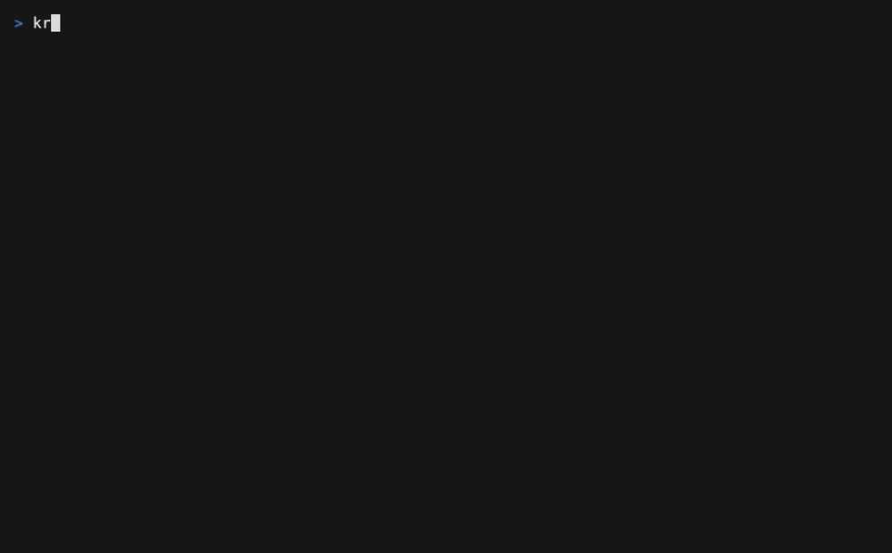

# Using the terminal interface

Running `kranz` opens the keyboard-first TUI. It is an operator view over the
same runtime used by the CLI and MCP, so a command or coding agent can inspect
the stack without opening a second copy.

## What is on screen

| Area | What it shows | Focus key |
| --- | --- | --- |
| Services / Tags | Services, dependencies, actions, groups, tags, selection, and lifecycle state | `1` |
| Details | The focused item's command, health, dependencies, ports, and current operation | `2` |
| Logs | Captured service, action, and lifecycle output with follow, wrap, timestamps, and regex search | `3` |

The header summarizes the runtime and active work. The footer shows the most
relevant keys for the current focus. Press `?` at any time for in-application
help.

## A first session

1. Use `↑` / `↓` or `j` / `k` to focus a service.
2. Press `Space` to select it, or `a` to select all services.
3. Press `s` to start the selection and its dependencies.
4. Press `2` to inspect readiness, liveness, dependencies, and ports.
5. Press `3` to follow logs; press `/` to search them.
6. Return to panel `1` and press `s` again to review and confirm the stop plan.

Actions appear below their service or project group. Focus an action and press
`s` to run it. Its output is multiplexed into the Logs panel and labeled with
the exact `OWNER/ACTION#run` identity.

## Common keys

| Key | Meaning |
| --- | --- |
| `1`, `2`, `3` | Focus Services/Tags, Details, or Logs |
| `Tab`, `Shift+Tab` | Move between panels |
| `Enter` | Expand or collapse the focused row |
| `Space` | Select or unselect a service or tag |
| `s` | Start, stop with confirmation, or run a focused action |
| `r` | Review and confirm a restart |
| `/` | Search logs with a regular expression |
| `Ctrl+T` | Open the theme and appearance picker |
| `Ctrl+L` | Reload configuration |
| `?` | Open help |
| `q` | Quit, with cleanup confirmation when required |

The [complete controls reference](../reference/controls) covers selection
overrides, log navigation, health history, notifications, shell handoff, mouse
interaction, and shutdown behavior. The guides for [actions](./actions),
[lifecycle](./lifecycle), [logs and ports](./logs-and-ports), and
[appearance](./appearance) include focused recordings of those workflows.
